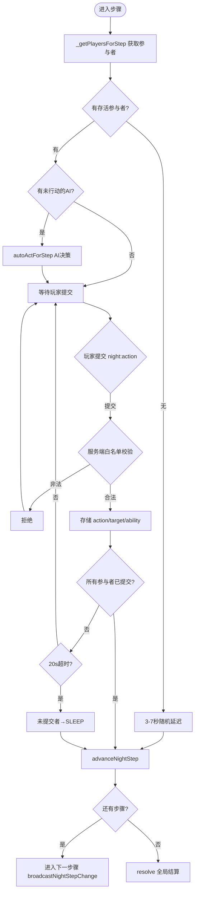

# 🐺 狼人杀 — 代码逻辑流程图 (v1.5.4)

## 一、游戏主循环

```mermaid
flowchart TD
    S([玩家连接服务器]) --> LOGIN{登录/快速游戏}
    LOGIN --> LOBBY[🏠 大厅]
    LOBBY --> CREATE[创建房间]
    LOBBY --> JOIN[加入房间]
    CREATE --> ROOM[🏠 等待室 - LOBBY阶段]
    JOIN --> ROOM

    ROOM --> SETTINGS{房主设置}
    SETTINGS --> |角色配置| CONFIG[自定义角色]
    SETTINGS --> |人机数量| BOTS[+/- AI数量]
    SETTINGS --> |隐私/密码| PRIVACY[公开/私密切换]
    SETTINGS --> |人数上限| MAXP[5-18人]
    CONFIG --> ROOM
    BOTS --> ROOM
    PRIVACY --> ROOM
    MAXP --> ROOM

    ROOM --> START[房主点击开始]
    START --> AUTOFILL{人数<6?}
    AUTOFILL --> |是| FILLBOTS[自动补充AI]
    AUTOFILL --> |否| ASSIGN
    FILLBOTS --> ASSIGN[分配角色 Fisher-Yates洗牌]
    ASSIGN --> NIGHT1

    NIGHT1[🌙 夜晚 - Round 1] --> NSTEP1

    subgraph NIGHT_LOOP[夜晚步骤循环]
        NSTEP1[ALPHA_WOLF 种狼]
        NSTEP1 --> NSTEP2[GUARD 守卫]
        NSTEP2 --> NSTEP3[WEREWOLF 狼人群]
        NSTEP3 --> NSTEP4[SEER 预言家]
        NSTEP4 --> NSTEP5[POISON_WITCH 毒巫]
        NSTEP5 --> NSTEP6[HEAL_WITCH 药巫]
        NSTEP6 --> NSTEP7[VILLAGER 村民]
        NSTEP7 --> NSTEP8[RESOLUTION 结算]
    end

    NSTEP8 --> CHECKWIN{检查胜利条件}
    CHECKWIN --> |狼全灭| GOODWIN[🎉 好人胜利]
    CHECKWIN --> |狼≥好| WOLFWIN[🐺 狼人胜利]
    CHECKWIN --> |继续| DAY

    DAY[☀️ 白天] --> HUNTER{猎人有枪?}
    HUNTER --> |开枪| SHOOT[猎人白天开枪]
    HUNTER --> |不开枪| DISCUSS
    SHOOT --> DISCUSS[🗣️ 讨论阶段]

    DISCUSS --> SPEAKER_LOOP{轮流发言}
    SPEAKER_LOOP --> |每人30s| SPEAK[当前发言人]
    SPEAK --> |跳过/超时| NEXT{还有下一个?}
    NEXT --> |是| SPEAK
    NEXT --> |否| VOTE

    VOTE[🗳️ 投票阶段] --> VOTE_TIMER{40s倒计时}
    VOTE_TIMER --> |全投完| TALLY[计票]
    VOTE_TIMER --> |超时| TALLY
    TALLY --> VOTE_RESULT{最高票≥半数?}
    VOTE_RESULT --> |是| ELIM[目标出局]
    VOTE_RESULT --> |否/平票| NOELIM[无人出局]

    ELIM --> LASTWORDS{死亡玩家发遗言?}
    LASTWORDS --> |发送| SENDLW[广播 💀遗言]
    LASTWORDS --> |跳过| RECHECK
    SENDLW --> RECHECK
    NOELIM --> RECHECK[再次检查胜利条件]

    RECHECK --> |游戏结束| GAMEOVER
    RECHECK --> |继续| NIGHTNEXT[🌙 下一夜 Round++]

    NIGHTNEXT --> NSTEP1_FULL

    subgraph FULL_NIGHT[第二晚起完整步骤]
        NSTEP1_FULL[HUNTER 猎人] --> NSTEP2_FULL[ALPHA_WOLF 种狼]
        NSTEP2_FULL --> NSTEP3_FULL[GUARD 守卫]
        NSTEP3_FULL --> NSTEP4_FULL[WEREWOLF 狼人群]
        NSTEP4_FULL --> NSTEP5_FULL[SEER 预言家]
        NSTEP5_FULL --> NSTEP6_FULL[POISON_WITCH 毒巫]
        NSTEP6_FULL --> NSTEP7_FULL[HEAL_WITCH 药巫]
        NSTEP7_FULL --> NSTEP8_FULL[VILLAGER 村民]
        NSTEP8_FULL --> NSTEP9_FULL[RESOLUTION 结算]
    end

    NSTEP9_FULL --> CHECKWIN

    GAMEOVER[🏆 游戏结束] --> REPLAY[保存回放]
    REPLAY --> TIMER30[30s后自动返回大厅]
    TIMER30 --> LOBBY

    GOODWIN --> GAMEOVER
    WOLFWIN --> GAMEOVER
```



## 二、夜晚步骤详细流程（单步骤）



## 三、夜晚结算 (NightResolver.resolve)

```mermaid
flowchart TD
    RESOLVE([开始结算]) --> STEP_H[HUNTER 猎人处理]
    STEP_H --> |观察目标是否出门| H_LOG[写入 privateLog]
    STEP_H --> |射杀/追踪| H_KILL[markForDeath]
    STEP_H --> |武器腐蚀| H_CORRODE[blunderbuss/rifle 失效]

    H_CORRODE --> STEP_A[ALPHA_WOLF 种狼处理]
    STEP_A --> |变狼| A_TRANSFORM[isTransformed=true]
    STEP_A --> |感染| A_INFECT{目标是预言家?}
    A_INFECT --> |是| A_SEER[预言家保留能力 查验反转]
    A_INFECT --> |否| A_NORMAL[目标下回合变狼]
    A_SEER --> A_RESET[重置 nightAction=null<br/>让种狼在狼人步骤重交]
    A_NORMAL --> A_RESET

    A_RESET --> STEP_G[GUARD 守卫处理]
    STEP_G --> |守护| G_SET[guardingTarget=目标 isGuarding=true]
    STEP_G --> |出门到目标家| G_HOUSE[currentHouse=目标]

    G_HOUSE --> STEP_W[WEREWOLF 狼人处理]
    STEP_W --> |遍历所有狼人| W_LOOP[检查 nightAbility.kill]
    W_LOOP --> |刀人| W_KILL[killTargets Map收集]
    W_LOOP --> |出门| W_GO[相认检测: 去了狼人家?]
    W_GO --> |互刀| W_MUTUAL[互刀→相认不死]

    W_MUTUAL --> STEP_S[SEER 预言家处理]
    STEP_S --> |查验| S_CHECK{目标身份判定}
    S_CHECK --> |普通狼人| S_WOLF[结果=WOLF]
    S_CHECK --> |种狼 未变狼未感染| S_GOOD[结果=GOOD]
    S_CHECK --> |种狼 已变狼或已感染| S_WOLF2[结果=WOLF]
    S_CHECK --> |预言家被感染| S_REVERSE[结果反转!]
    S_WOLF --> S_LOG[写入 privateLog seer_check]
    S_GOOD --> S_LOG
    S_WOLF2 --> S_LOG
    S_REVERSE --> S_LOG

    S_LOG --> STEP_PW[POISON_WITCH 毒巫处理]
    STEP_PW --> |烈性毒药| PW_POISON[获取屋内所有人]
    PW_POISON --> PW_GUARD{屋内≥3人且有守卫?}
    PW_GUARD --> |是| PW_HURT[守卫重伤 其余毒死]
    PW_GUARD --> |否| PW_ALL[全部毒死]

    PW_ALL --> STEP_HW[HEAL_WITCH 药巫处理]
    PW_HURT --> STEP_HW
    STEP_HW --> |万能药| HW_HEAL[治疗一切: 救活+治重伤]
    STEP_HW --> |单目标毒| HW_POISON{目标离开屋子?}
    HW_POISON --> |是| HW_TRANSFER[毒转移到第一进入者]
    HW_POISON --> |否| HW_KILL[毒杀目标]

    HW_TRANSFER --> STEP_V[VILLAGER 村民处理]
    HW_HEAL --> STEP_V
    HW_KILL --> STEP_V

    STEP_V --> |出门| V_GO[currentHouse=目标]
    STEP_V --> |偷听| V_EAVES{扫描目标屋内成员}
    V_EAVES --> |有狼人| V_W[候选:狼嚎/野兽呼吸]
    V_EAVES --> |有神职| V_G[候选:祈祷/法器]
    V_EAVES --> |有人| V_P[候选:交谈/脚步]
    V_EAVES --> |空屋| V_EMPTY[候选:空无一人/安静]
    V_W --> V_PICK[随机选一条结果]
    V_G --> V_PICK
    V_P --> V_PICK
    V_EMPTY --> V_PICK
    V_PICK --> V_LOG[写入 privateLog eavesdrop]

    V_GO --> COLLECT[collectHouseVisitInfo]
    V_LOG --> COLLECT

    COLLECT --> |遍历出门玩家| VISIT[统计目标屋访客数]
    VISIT --> |村民+≥3人| V_BACK[被赶回家 显示很多人]
    VISIT --> |其他| V_COUNT[显示实际人数]

    V_BACK --> DEATH[resolveAllDeaths 处理死亡]
    V_COUNT --> DEATH

    DEATH --> |守卫保护判定| GUARD_CHECK{守卫在目标屋?}
    GUARD_CHECK --> |≤2人| GUARD_SAVE[守卫重伤 保护成功]
    GUARD_CHECK --> |≥3人| GUARD_FAIL[守卫重伤 目标仍死]
    GUARD_CHECK --> |独自在家1狼| GUARD_ALONE[重伤 狼知晓身份]

    GUARD_SAVE --> HUNTER_DEF{目标有短火铳?}
    GUARD_FAIL --> HUNTER_DEF
    GUARD_ALONE --> HUNTER_DEF

    HUNTER_DEF --> |有且可用| HUNTER_KILL[反杀所有攻击者]
    HUNTER_DEF --> |无| NORMAL_KILL[正常击杀]
    HUNTER_KILL --> APPLY
    NORMAL_KILL --> APPLY

    APPLY[applyDeathMarks 执行死亡] --> INFECT_EFFECT[应用感染效果]
    INFECT_EFFECT --> CHECK_WIN[checkWinCondition]
    CHECK_WIN --> |游戏结束| END
    CHECK_WIN --> |继续| PUSH[推送 privateState 给每位存活玩家]
    PUSH --> DAY_START([进入白天])
    END --> GAME_OVER([游戏结束])
```



## 四、连接生命周期

```mermaid
flowchart TD
    CONNECT([Socket.IO 连接]) --> HANDLERS[registerHandlers 注册事件]
    HANDLERS --> AUTH{认证状态}
    AUTH --> |未登录| LOGIN_PAGE[登录/注册/快速游戏]
    AUTH --> |已登录| LOBBY_JOIN

    LOGIN_PAGE --> |auth:register| REG[UserManager.register]
    LOGIN_PAGE --> |auth:login| LOG[UserManager.login]
    LOGIN_PAGE --> |快速游戏| QUICK[直接设置名字]
    REG --> SET_SESSION[setSession socketId→username]
    LOG --> SET_SESSION

    SET_SESSION --> LOBBY_JOIN[进入大厅]

    LOBBY_JOIN --> |room:create| CREATE_R[GameManager.createRoom]
    LOBBY_JOIN --> |room:join| JOIN_R[GameManager.joinRoom]
    LOBBY_JOIN --> |lobby:list| LIST[getLobbyList]

    CREATE_R --> ROOM_ENTER[socket.join(roomId)]
    JOIN_R --> ROOM_ENTER

    ROOM_ENTER --> GAME_LOOP[游戏主循环]

    GAME_LOOP --> DISCONNECT{玩家断线}
    DISCONNECT --> |大厅中| LEAVE[直接离开]
    DISCONNECT --> |游戏中| MARK_OFF[标记 disconnected=true]
    MARK_OFF --> RECONN{120s内重连?}
    RECONN --> |room:rejoin| RECONNECT_OK[迁移所有状态引用<br/>投票/日志/目标/房主]
    RECONN --> |超时| KILL[判定出局 alive=false]
    RECONNECT_OK --> GAME_LOOP
    KILL --> GAME_LOOP

    GAME_LOOP --> GAME_END[游戏结束]
    GAME_END --> |30s后| RETURN[returnToLobby 重置状态]
    RETURN --> ROOM_ENTER
```

## 五、关键数据结构

```
Game {
  id, hostId, players[], phase, round, nightStep
  votes{}, voteResults, nightLog[], dayLog[]
  privateLogs{}      // { playerId: [entries] }
  customRoleConfig[] // 房主自定义角色
  enableBots, botCount  // AI 设置
  _phaseTimeout, _advancingNightStep  // 计时器+锁
}

Player {
  id, name, role, team, alive, disconnected, isBot
  nightAction, nightTarget, nightAbility  // 当晚行动（每步骤可覆写）
  currentHouse, atHome                     // 位置状态
  // 角色特有状态...
  isTransformed, hasUsedInfect, infectedByAlpha  // 种狼
  checkResult, checkTarget                       // 预言家
  hasPotion, hasPoison, poisonTarget             // 女巫
  guardingTarget, isGuarding, heavyInjury        // 守卫
  hasRifle, hasBlunderbuss, canAct               // 猎人
  hasLastWords                                    // 遗言
}

NightResolver {
  game, players, log[], privateLog[]
  wolfKills: Map<targetId, wolfIds[]>  // 狼人击杀收集
  deathMarks: Map<playerId, reason>    // 死亡标记队列
}

BotManager {
  game, _timers
  memory: {
    checkedPlayers, knownWolves, knownGods
    attackHistory, voteHistory, deathHistory
    suspicion: Map<playerId, score>
  }
}

UserManager {
  users: Map, sessions: Map, replays: {}
  _writeQueue: Promise  // 写队列串行化
}
```

## 六、胜利条件判定

```
checkWinCondition():
  aliveWolves = 存活且属于狼人阵营的玩家
    (普通狼人 || 种狼已变狼 || 种狼已使用感染)

  aliveVillage = 存活且属于好人阵营的玩家
    (好人阵营角色 || 种狼未变狼且未感染)

  if aliveWolves.length === 0
    → 好人胜利 "所有狼人已出局"

  if aliveWolves.length >= aliveVillage.length
    → 狼人胜利 "狼人数量不少于好人"
```

---

> 流程图使用 Mermaid 语法，在 VS Code 中安装 Markdown Preview Mermaid 扩展即可预览。
